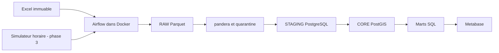

# Casablanca Traffic Data Platform

Plateforme de données de trafic de Casablanca : source Excel immuable, Parquet,
validation pandera, entrepôt PostgreSQL/PostGIS et restitution Metabase.
Le plan de référence complet est dans [docs/project_plan.md](docs/project_plan.md).

## État du projet

Phase 0 validée : cadrage, structure, source et environnement de développement.
Phase 1 validée : infrastructure Docker démarrée et contrôlée.
Preuves : `docs/phase0_verification.md` et `docs/phase1_verification.md`.
Phase 2 validée : les 13 feuilles sont profilées, le notebook est exécuté et les règles
de nettoyage sont documentées dans `docs/data_quality_report.md`.
Phase 3 validée : 13 Parquet RAW immuables, 168 partitions de rejeu horaire et
le DAG `ingest_traffic` exécuté avec dynamic task mapping. Preuves dans
`docs/phase3_verification.md` et `docs/phase3_runs.json`.
Phase 4 validée : contrats pandera, journal PostgreSQL `quarantine` et gate qualité
intégrés à l'ingestion. Preuves : `docs/phase4_verification.md` et `docs/phase4_runs.json`.
Phase 5 validée : unités et clés normalisées, modèle STAGING/CORE chargé avec
22 communes, 110 points, 168 créneaux, 440 trajets et 73 920 faits.
Preuves d'idempotence et de rollback : `docs/phase5_runs.json`, `docs/phase5_verification.md`.
Phase 6 validée : quatre marts reconstruits en SQL, vérifiés par un oracle pandas
indépendant, avec idempotence et rollback. Preuves : `docs/phase6_verification.md`.
Les phases 7 à 10 restent à réaliser.

## Architecture cible



## Développement local (Windows PowerShell)

Python **3.11** et Docker Desktop avec moteur Linux sont obligatoires.
Toutes les commandes Python utilisent explicitement le venv `CasaTraffic`.

```powershell
cd casablanca-traffic-platform
py -3.11 -m venv CasaTraffic
.\CasaTraffic\Scripts\python.exe --version
.\CasaTraffic\Scripts\python.exe -m pip install -r requirements.txt
.\CasaTraffic\Scripts\python.exe -m pip check
.\CasaTraffic\Scripts\python.exe scripts/verify_phase0.py
.\CasaTraffic\Scripts\python.exe -m ruff check .
.\CasaTraffic\Scripts\python.exe -m pytest -q
```

Linux : créer avec `python3.11 -m venv CasaTraffic` et remplacer l'exécutable
par `CasaTraffic/bin/python`. Airflow est installé exclusivement dans l'image Docker.

## Lancement Docker

```powershell
.\CasaTraffic\Scripts\python.exe scripts/init_env.py
docker compose config --quiet
docker compose up -d --build
docker compose ps --all
.\CasaTraffic\Scripts\python.exe scripts/verify_phase1.py
```

`init_env.py` crée .env avec des secrets aléatoires. S'il existe déjà, conserver
le fichier : ne pas relancer la génération. `.env.example` décrit les variables.
Airflow : http://localhost:8080 (identifiants `AIRFLOW_ADMIN_USERNAME` et
`AIRFLOW_ADMIN_PASSWORD` dans .env). Metabase : http://localhost:3000.
PostgreSQL : localhost:5432 ; base `traffic`, rôle `traffic`, mot de passe
`TRAFFIC_DB_PASSWORD` de .env. Les ports sont configurables et liés à 127.0.0.1.

La configuration suit [la documentation Docker Airflow 2.11.2](https://airflow.apache.org/docs/apache-airflow/2.11.2/howto/docker-compose/)
avec LocalExecutor. Metabase utilise [une base applicative PostgreSQL](https://www.metabase.com/docs/latest/installation-and-operation/running-metabase-on-docker).
Prévoir au moins 4 Go de mémoire Docker, idéalement 8 Go.

`airflow-init` se termine avec le code 0 après migration et création du compte.
Les quatre services permanents doivent être healthy. Les dossiers DAGs sont vides
à la phase 1 : les DAGs métier seront ajoutés en phases 3 à 7.
Metabase démarre sur l'assistant initial ; les visualisations seront configurées en phase 9.

```powershell
# Arrêt en conservant les données
docker compose down
# Redémarrage avec les mêmes données et secrets
docker compose up -d
# Diagnostics
docker compose logs --tail 100 airflow-scheduler airflow-webserver metabase
```

Le volume `postgres_data` conserve les bases. Ne pas utiliser `down --volumes`
pour un simple redémarrage. Le SQL initial ne s'exécute que sur un volume vide.
Pour un autre poste neuf : recréer CasaTraffic, installer les requirements, fournir
la source identique et générer un nouveau .env, puis exécuter les commandes de lancement.

## Données et objectifs

Source : `data/source/Dataset_for_traffic_analysis_in_Casablanca__Morocco.xlsx`.
Ne jamais enregistrer de modification dans ce classeur.
SHA-256 : `4778abffbe3d7791afa58069fc8a98b6e89995174d4c64401d9367221c42d17d`.

Objectifs à vérifier après profilage et chargement : 22 communes, 110 points,
440 trajets et 73 920 mesures (7 jours × 24 heures × 440 trajets).
La semaine est une semaine type, sans date d'observation.
Le dictionnaire provisoire est dans `docs/data_dictionary.md` ; les KPI dans
`docs/business_scope.md` ; les décisions dans `docs/decisions.md`.

## Reproduire le profilage (phase 2)

```powershell
.\CasaTraffic\Scripts\python.exe scripts/profile_workbook.py
.\CasaTraffic\Scripts\python.exe -m ipykernel install --prefix .\CasaTraffic --name casatraffic --display-name "CasaTraffic (Python 3.11)"
.\CasaTraffic\Scripts\python.exe scripts/verify_phase2.py
.\CasaTraffic\Scripts\python.exe -m jupyter lab notebooks/02_source_profiling.ipynb
```

Sélectionner `CasaTraffic (Python 3.11)` dans Jupyter. Le vérificateur exécute les
sept cellules de code avec ce kernel, vérifie la source et conserve les sorties.
Les 73 920 diagnostics Parquet sont dans `docs/profiling/` : ce sont des résultats
exploratoires avec valeurs brutes et candidates, pas la couche RAW de production.

## Ingestion RAW et simulateur (phase 3)

```powershell
.\CasaTraffic\Scripts\python.exe scripts/extract_raw.py
# Une heure : tick 0 = lundi 00 h, tick 24 = mardi 00 h
.\CasaTraffic\Scripts\python.exe -m src.extract.flow_simulator --source "data/source/Dataset_for_traffic_analysis_in_Casablanca__Morocco.xlsx" --raw-root data/raw --tick 0
# Semaine type complète, 168 tranches
.\CasaTraffic\Scripts\python.exe -m src.extract.flow_simulator --source "data/source/Dataset_for_traffic_analysis_in_Casablanca__Morocco.xlsx" --raw-root data/raw --tick 0 --steps 168
.\CasaTraffic\Scripts\python.exe scripts/verify_phase3.py
.\CasaTraffic\Scripts\python.exe -m pytest -q
.\CasaTraffic\Scripts\python.exe -m ruff check .
```

Les fichiers sont sous `data/raw/source_sha256=<empreinte>/` : Summary et tables
0–11 ; le rejeu sous `replay/day=1..7/hour=00..23.parquet`. Chaque fichier conserve
`_ingested_at` UTC, `_source_file`, `_sheet`, `_source_sha256`, `_payload_sha256`
et le numéro de ligne Excel. Les labels commune/ZIP bruts restent également présents.
Les temps, distances, indices et TTI ne sont pas corrigés dans RAW.
Les partitions existantes sont vérifiées puis réutilisées sans changer leurs octets.

Dans [Airflow](http://localhost:8080), activer `ingest_traffic` puis déclencher
avec la configuration `{"mode":"full"}` pour les sept jours mappés, ou
`{"mode":"replay","tick":0}` pour une tranche. La planification `@hourly`
utilise le mode replay par défaut ; le vérificateur active le DAG et laisse ce
rejeu horaire actif. Sans tick explicite, le tick est dérivé de l'intervalle logique
Airflow et d'une ancre de simulation UTC. Les Variables facultatives sont
`traffic_source_file`, `traffic_raw_root`, `traffic_replay_anchor`
(défaut `2026-01-05T00:00:00Z`). Le tick boucle modulo 168 ; il ne crée pas de date
d'observation. Aucun appel réseau à Waze n'est effectué.

La concurrence est limitée à quatre tâches ; les sept jours passent en deux vagues.
Le vérificateur déclenche quatre runs réels et consigne leurs états et horodatages.
Les trois autres DAGs seront ajoutés à la phase 7. Le DAG d'ingestion charge maintenant les faits.

## Validation et quarantine (phase 4)

```powershell
.\CasaTraffic\Scripts\python.exe scripts/verify_phase4.py
.\CasaTraffic\Scripts\python.exe -m pytest -q
.\CasaTraffic\Scripts\python.exe -m ruff check .
```

Chaque run `ingest_traffic` valide les références, puis chaque jour/tranche par mapping.
Les schémas contrôlent types, nombres finis, bornes géographiques, temps >0,
TTI source ≥1, comptes entiers, cardinalités et unicité. Les contrôles référentiels
vérifient commune/ZIP et la concordance index/coordonnées avec Table 0.
Les nombres sont convertis dans une vue temporaire de validation ; le RAW reste intact.

Les anomalies sont insérées dans `traffic.public.quarantine` via la Connection
Airflow `casatraffic`, avec payload brut JSON, feuille, ligne Excel, heure et motif.
`hour=-1` signifie une anomalie de ligne entière. Un identifiant déterministe et
un upsert évitent les doublons ; la première observation est conservée.
Les rapports par run sont sous `data/quarantine/reports/`, avec noms compatibles Windows.

Trois sévérités : `rejected` bloque la mesure, `repairable` impose une correction
en phase 5, `warning` signale un TTI >5. Les indices connus 110–114 ne sont réparables
que si la source et les coordonnées confirment le crosswalk ; aucun décalage général
n'est appliqué. Un TTI source positif <1 est conservé pour recalcul à partir du temps.
Il ne sera pas chargé tel quel dans le fait. Les compteurs réconcilient toutes les mesures.

La Variable `traffic_max_error_rate` vaut **0.01** par défaut. Après persistance
des événements et du rapport, un taux de rejet **strictement supérieur à 1 %**
fait échouer la tâche. Les cas réparables et avertissements sont audités séparément.
Le seuil s'applique à chaque partition ; au-delà du seuil, le run ne poursuit pas
vers la réconciliation finale. Ne pas désactiver la journalisation pour contourner un rejet.

Sur la source : **70 557 mesures sans réparation bloquante, 3 363 réparables,
0 rejet bloquant**, total 73 920. La table quarantine contient **485 événements**
(314 réparables et 171 avertissements) après plusieurs runs identiques.
Une mesure peut avoir plusieurs motifs ; un événement sur une ligne quotidienne
peut concerner ses 24 heures. Les 198 lignes des tables 0–4 satisfont leurs contrats.
Ces classes décrivent le RAW : la phase 5 répare les cas admissibles avant CORE.

## STAGING et CORE (phase 5)

```powershell
.\CasaTraffic\Scripts\python.exe scripts/verify_phase5.py
.\CasaTraffic\Scripts\python.exe -m pytest -q
.\CasaTraffic\Scripts\python.exe -m ruff check .
```

Déclencher `ingest_traffic` avec `{"mode":"full"}` charge les sept jours ; le mode
`{"mode":"replay","tick":0}` remplace uniquement le lundi à 00 h. Le DAG valide
les références, initialise les dimensions et la référence TTI, puis charge les jours
par dynamic task mapping. Ce bootstrap sera également exposé par le DAG manuel
de phase 7. Il lit les sept jours pour confirmer la référence, même en mode rejeu.

Tables STAGING : `staging.commune`, `staging.point`, `staging.trajectory`,
`staging.travel_time`. Tables CORE dans `public` : `dim_commune`, `dim_point`,
`dim_time`, `dim_trajectory`, `fact_travel_time`. Le DDL s'applique au volume existant.
Les règles D010–D012 sont implémentées ; aucune écriture dans le classeur ou le RAW.

La distance devient km ; les grands temps entiers sont corrigés seulement pour le
SHA-256 diagnostiqué. Les clés commune normalisent Unicode, espaces et casse.
Chaque mesure garde temps/distance/indices bruts, conversions, TTI fourni, écart,
provenance et référence. Le TTI et la vitesse sont calculés en SQL versionné :
`travel_time_min / free_flow_reference_min` et `60 * distance_observed_km / travel_time_min`.
Pandera prévalide ces valeurs avec la référence figée ; PostgreSQL impose également
les bornes, clés primaires et étrangères. Les échecs sont journalisés avant le gate.

Les clés sont déterministes : commune_id = ZIP numérique, point_id = index Table 0,
trajectory_id = origine ×110 + destination +1 ; dim_time utilise (jour ISO, heure).
La géométrie WGS84 est générée par PostgreSQL avec longitude en X et latitude en Y.
La référence du lundi et le minimum hebdomadaire des trajets sont conservés ; une
référence différente exige une migration explicite, pas une mise à jour silencieuse.

Chaque partition STAGING et CORE est remplacée dans une même transaction, avec
verrous par jour/heure. Une erreur annule les deux remplacements. Les autres heures
restent présentes pendant un rejeu. Les jours d'un full commitent séparément ; un
run partiellement échoué se reprend par relance idempotente. Le vérificateur compare
les comptes et empreintes de contenu des dimensions et des mesures après full/full
et replay/replay, puis injecte une panne SQL temporaire pour prouver le rollback.

État constaté : **73 920 lignes dans STAGING et fact_travel_time**, sans doublon.
TTI minimum 1, moyenne 1,323890 et maximum 4,548759. 70 810 écarts absolus >0,1
avec le TTI fourni sont signalés ; la différence de référence est documentée.

## Data marts (phase 6)

```powershell
.\CasaTraffic\Scripts\python.exe scripts/build_marts.py
.\CasaTraffic\Scripts\python.exe scripts/verify_phase6.py
```

Les quatre tables sont dans `traffic.public` et leurs SQL dans `sql/marts/` :

| Mart | Grain | Lignes constatées |
|---|---|---:|
| mart_commune_hourly_congestion | commune × jour × heure | 3 696 |
| mart_peak_hours | commune × jour × heure maximale, égalités conservées | 154 |
| mart_weekday_vs_weekend | commune × is_weekend | 44 |
| mart_commune_features | commune, KPI et attributs urbains | 22 |

Les agrégats utilisent le TTI recalculé et la commune d'origine. Chaque observation
a le même poids. Le p95 est interpolé depuis les faits ; les p95 horaires ne sont
pas moyennés pour produire un p95 hebdomadaire. Chaque groupe horaire a 20 mesures ;
chaque commune a 2 400 mesures lundi–vendredi et 960 samedi–dimanche.
Les effectifs et nombre de jours sont exposés pour comparer les moyennes.

Le constructeur exige la semaine type complète (73 920 faits), verrouille les
tables CORE en lecture, puis remplace les quatre marts dans une transaction.
Une erreur conserve leurs versions précédentes. Les requêtes ordonnent les valeurs
des moyennes pour rendre les résultats flottants stables après reconstruction.
La commande locale utilise .env ; la même fonction est validée dans Docker avec
la Connection `casatraffic`. Le DAG `build_marts` et son déclenchement après ingestion
seront ajoutés à la phase 7. Jusqu'alors, reconstruire manuellement après une ingestion.

Exemple de classement, exécutable dans PostgreSQL :

```sql
SELECT nom, measurement_count, tti_mean, tti_p95
FROM public.mart_commune_features
ORDER BY tti_mean DESC, commune_id;
```

`mart_commune_features` conserve les variables urbaines avec leur précision et leurs
unités. Pour une analyse prédictive, distinguer la cible TTI des autres KPI de congestion
et construire la référence TTI seulement sur l'entraînement. Les 22 communes et cette
seule semaine type permettent d'abord une analyse descriptive.

## Limites connues et suite

Le profilage constate 2 764 distances en mètres, 42 174 temps ayant perdu leur
séparateur décimal, cinq indices décalés et 254 trajets dont la distance varie.
La suite de maxima TTI 5, 6, …, 23 annoncée dans le plan n'est pas présente dans cette source.
Le simulateur ne représentera pas une collecte réelle. Les relations entre variables
urbaines et congestion seront descriptives et ne prouveront pas de causalité.
Les autres DAGs, les tests/CI complémentaires et le dashboard seront implémentés à leurs phases
respectives. Les 43 tests présents couvrent lecture, publication RAW, rejeu, contrats
pandera, rejets, références, doublons, seuil, conversions, dépivotage et validation CORE.
Les tests qualité reconstruisent leurs RAW temporaires depuis la source versionnée,
sans dépendre des fichiers RAW locaux ignorés par Git.
