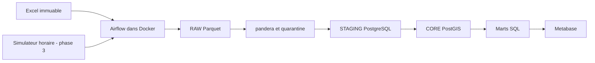

# Casablanca Traffic Data Platform

Plateforme de données de trafic de Casablanca : source Excel immuable, Parquet,
validation pandera, entrepôt PostgreSQL/PostGIS et restitution Metabase.
Le plan de référence complet est dans [docs/project_plan.md](docs/project_plan.md).

## État du projet

Phase 0 : cadrage, structure, source et environnement de développement.
Phase 1 : infrastructure Docker. Les phases 2 à 10 restent à réaliser.
Aucune mesure métier n'est encore chargée ; les cardinalités du plan sont des objectifs.

## Architecture cible



## Développement local (Windows PowerShell)

Python **3.11** et Docker Desktop avec moteur Linux sont obligatoires.
Toutes les commandes Python utilisent explicitement le venv `CasaTraffic`.

```powershell
cd casablanca-traffic-platform
py -3.11 -m venv CasaTraffic
.\CasaTraffic\Scripts\python.exe --version
.\CasaTraffic\Scripts\python.exe -m pip install -r requirements.txt
.\CasaTraffic\Scripts\python.exe -m pip check
.\CasaTraffic\Scripts\python.exe scripts/verify_phase0.py
.\CasaTraffic\Scripts\python.exe -m ruff check .
```

Linux : créer avec `python3.11 -m venv CasaTraffic` et remplacer l'exécutable
par `CasaTraffic/bin/python`. Airflow est installé exclusivement dans l'image Docker.
Les instructions Docker seront complétées pendant la phase 1.

## Données et objectifs

Source : `data/source/Dataset_for_traffic_analysis_in_Casablanca__Morocco.xlsx`.
Ne jamais enregistrer de modification dans ce classeur.
SHA-256 : `4778abffbe3d7791afa58069fc8a98b6e89995174d4c64401d9367221c42d17d`.

Objectifs à vérifier après profilage et chargement : 22 communes, 110 points,
440 trajets et 73 920 mesures (7 jours × 24 heures × 440 trajets).
La semaine est une semaine type, sans date d'observation.
Le dictionnaire provisoire est dans `docs/data_dictionary.md` ; les KPI dans
`docs/business_scope.md` ; les décisions dans `docs/decisions.md`.

## Limites connues et suite

Les anomalies citées dans le plan (en-têtes fusionnés, unités mixtes, TTI suspects,
fautes de noms) doivent être mesurées en phase 2 avant d'appliquer les règles.
Le simulateur ne représentera pas une collecte réelle. Les relations entre variables
urbaines et congestion seront descriptives et ne prouveront pas de causalité.
Les DAGs, marts, tests métier, CI et dashboard seront implémentés à leurs phases respectives.
