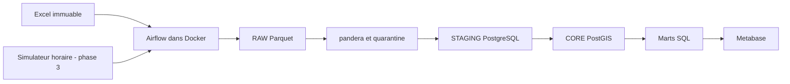

# Casablanca Traffic Data Platform

Plateforme de données de trafic de Casablanca : source Excel immuable, Parquet,
validation pandera, entrepôt PostgreSQL/PostGIS et restitution Metabase.
Le plan de référence complet est dans [docs/project_plan.md](docs/project_plan.md).

## État du projet

Phase 0 validée : cadrage, structure, source et environnement de développement.
Phase 1 validée : infrastructure Docker démarrée et contrôlée.
Preuves : `docs/phase0_verification.md` et `docs/phase1_verification.md`.
Phase 2 validée : les 13 feuilles sont profilées, le notebook est exécuté et les règles
de nettoyage sont documentées dans `docs/data_quality_report.md`.
Phase 3 validée : 13 Parquet RAW immuables, 168 partitions de rejeu horaire et
le DAG `ingest_traffic` exécuté avec dynamic task mapping. Preuves dans
`docs/phase3_verification.md` et `docs/phase3_runs.json`.
Les phases 4 à 10 restent à réaliser.
Aucune mesure métier n'est encore chargée ; les cardinalités du plan sont des objectifs.

## Architecture cible



## Développement local (Windows PowerShell)

Python **3.11** et Docker Desktop avec moteur Linux sont obligatoires.
Toutes les commandes Python utilisent explicitement le venv `CasaTraffic`.

```powershell
cd casablanca-traffic-platform
py -3.11 -m venv CasaTraffic
.\CasaTraffic\Scripts\python.exe --version
.\CasaTraffic\Scripts\python.exe -m pip install -r requirements.txt
.\CasaTraffic\Scripts\python.exe -m pip check
.\CasaTraffic\Scripts\python.exe scripts/verify_phase0.py
.\CasaTraffic\Scripts\python.exe -m ruff check .
.\CasaTraffic\Scripts\python.exe -m pytest -q
```

Linux : créer avec `python3.11 -m venv CasaTraffic` et remplacer l'exécutable
par `CasaTraffic/bin/python`. Airflow est installé exclusivement dans l'image Docker.

## Lancement Docker

```powershell
.\CasaTraffic\Scripts\python.exe scripts/init_env.py
docker compose config --quiet
docker compose up -d --build
docker compose ps --all
.\CasaTraffic\Scripts\python.exe scripts/verify_phase1.py
```

`init_env.py` crée .env avec des secrets aléatoires. S'il existe déjà, conserver
le fichier : ne pas relancer la génération. `.env.example` décrit les variables.
Airflow : http://localhost:8080 (identifiants `AIRFLOW_ADMIN_USERNAME` et
`AIRFLOW_ADMIN_PASSWORD` dans .env). Metabase : http://localhost:3000.
PostgreSQL : localhost:5432 ; base `traffic`, rôle `traffic`, mot de passe
`TRAFFIC_DB_PASSWORD` de .env. Les ports sont configurables et liés à 127.0.0.1.

La configuration suit [la documentation Docker Airflow 2.11.2](https://airflow.apache.org/docs/apache-airflow/2.11.2/howto/docker-compose/)
avec LocalExecutor. Metabase utilise [une base applicative PostgreSQL](https://www.metabase.com/docs/latest/installation-and-operation/running-metabase-on-docker).
Prévoir au moins 4 Go de mémoire Docker, idéalement 8 Go.

`airflow-init` se termine avec le code 0 après migration et création du compte.
Les quatre services permanents doivent être healthy. Les dossiers DAGs sont vides
à la phase 1 : les DAGs métier seront ajoutés en phases 3 à 7.
Metabase démarre sur l'assistant initial ; les visualisations seront configurées en phase 9.

```powershell
# Arrêt en conservant les données
docker compose down
# Redémarrage avec les mêmes données et secrets
docker compose up -d
# Diagnostics
docker compose logs --tail 100 airflow-scheduler airflow-webserver metabase
```

Le volume `postgres_data` conserve les bases. Ne pas utiliser `down --volumes`
pour un simple redémarrage. Le SQL initial ne s'exécute que sur un volume vide.
Pour un autre poste neuf : recréer CasaTraffic, installer les requirements, fournir
la source identique et générer un nouveau .env, puis exécuter les commandes de lancement.

## Données et objectifs

Source : `data/source/Dataset_for_traffic_analysis_in_Casablanca__Morocco.xlsx`.
Ne jamais enregistrer de modification dans ce classeur.
SHA-256 : `4778abffbe3d7791afa58069fc8a98b6e89995174d4c64401d9367221c42d17d`.

Objectifs à vérifier après profilage et chargement : 22 communes, 110 points,
440 trajets et 73 920 mesures (7 jours × 24 heures × 440 trajets).
La semaine est une semaine type, sans date d'observation.
Le dictionnaire provisoire est dans `docs/data_dictionary.md` ; les KPI dans
`docs/business_scope.md` ; les décisions dans `docs/decisions.md`.

## Reproduire le profilage (phase 2)

```powershell
.\CasaTraffic\Scripts\python.exe scripts/profile_workbook.py
.\CasaTraffic\Scripts\python.exe -m ipykernel install --prefix .\CasaTraffic --name casatraffic --display-name "CasaTraffic (Python 3.11)"
.\CasaTraffic\Scripts\python.exe scripts/verify_phase2.py
.\CasaTraffic\Scripts\python.exe -m jupyter lab notebooks/02_source_profiling.ipynb
```

Sélectionner `CasaTraffic (Python 3.11)` dans Jupyter. Le vérificateur exécute les
sept cellules de code avec ce kernel, vérifie la source et conserve les sorties.
Les 73 920 diagnostics Parquet sont dans `docs/profiling/` : ce sont des résultats
exploratoires avec valeurs brutes et candidates, pas la couche RAW de production.

## Ingestion RAW et simulateur (phase 3)

```powershell
.\CasaTraffic\Scripts\python.exe scripts/extract_raw.py
# Une heure : tick 0 = lundi 00 h, tick 24 = mardi 00 h
.\CasaTraffic\Scripts\python.exe -m src.extract.flow_simulator --source "data/source/Dataset_for_traffic_analysis_in_Casablanca__Morocco.xlsx" --raw-root data/raw --tick 0
# Semaine type complète, 168 tranches
.\CasaTraffic\Scripts\python.exe -m src.extract.flow_simulator --source "data/source/Dataset_for_traffic_analysis_in_Casablanca__Morocco.xlsx" --raw-root data/raw --tick 0 --steps 168
.\CasaTraffic\Scripts\python.exe scripts/verify_phase3.py
.\CasaTraffic\Scripts\python.exe -m pytest -q
.\CasaTraffic\Scripts\python.exe -m ruff check .
```

Les fichiers sont sous `data/raw/source_sha256=<empreinte>/` : Summary et tables
0–11 ; le rejeu sous `replay/day=1..7/hour=00..23.parquet`. Chaque fichier conserve
`_ingested_at` UTC, `_source_file`, `_sheet`, `_source_sha256`, `_payload_sha256`
et le numéro de ligne Excel. Les labels commune/ZIP bruts restent également présents.
Les temps, distances, indices et TTI ne sont pas corrigés dans RAW.
Les partitions existantes sont vérifiées puis réutilisées sans changer leurs octets.

Dans [Airflow](http://localhost:8080), activer `ingest_traffic` puis déclencher
avec la configuration `{"mode":"full"}` pour les sept jours mappés, ou
`{"mode":"replay","tick":0}` pour une tranche. La planification `@hourly`
utilise le mode replay par défaut ; le vérificateur active le DAG et laisse ce
rejeu horaire actif. Sans tick explicite, le tick est dérivé de l'intervalle logique
Airflow et d'une ancre de simulation UTC. Les Variables facultatives sont
`traffic_source_file`, `traffic_raw_root`, `traffic_replay_anchor`
(défaut `2026-01-05T00:00:00Z`). Le tick boucle modulo 168 ; il ne crée pas de date
d'observation. Aucun appel réseau à Waze n'est effectué.

La concurrence est limitée à quatre tâches ; les sept jours passent en deux vagues.
Le vérificateur déclenche quatre runs réels et consigne leurs états et horodatages.
Les trois autres DAGs seront ajoutés à la phase 7. Validation pandera, quarantine
et chargement des faits restent les phases 4–5.

## Limites connues et suite

Le profilage constate 2 764 distances en mètres, 42 174 temps ayant perdu leur
séparateur décimal, cinq indices décalés et 254 trajets dont la distance varie.
La suite de maxima TTI 5, 6, …, 23 annoncée dans le plan n'est pas présente dans cette source.
Le simulateur ne représentera pas une collecte réelle. Les relations entre variables
urbaines et congestion seront descriptives et ne prouveront pas de causalité.
Les autres DAGs, marts, tests métier, CI et dashboard seront implémentés à leurs phases
respectives. Les 22 tests présents couvrent la lecture, le parseur Airflow, la publication
RAW concurrente et immuable, la détection de corruption et les frontières du rejeu.
