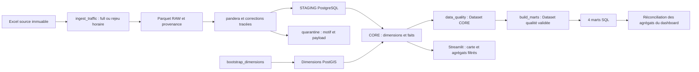
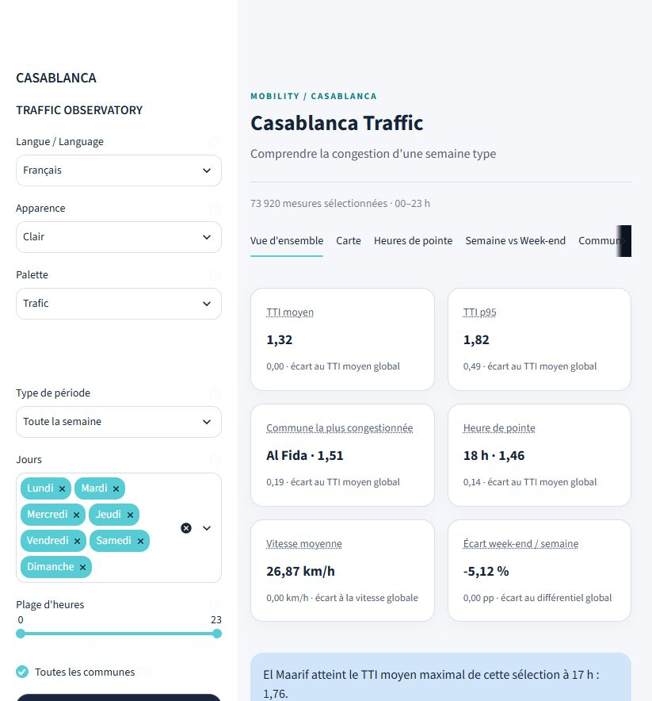
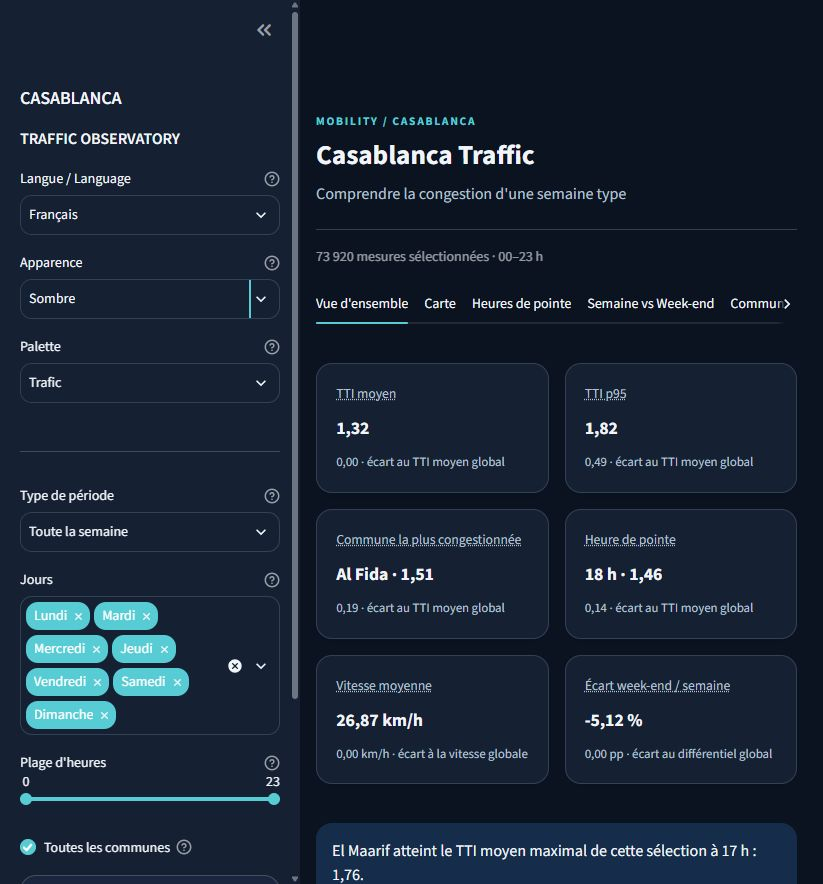
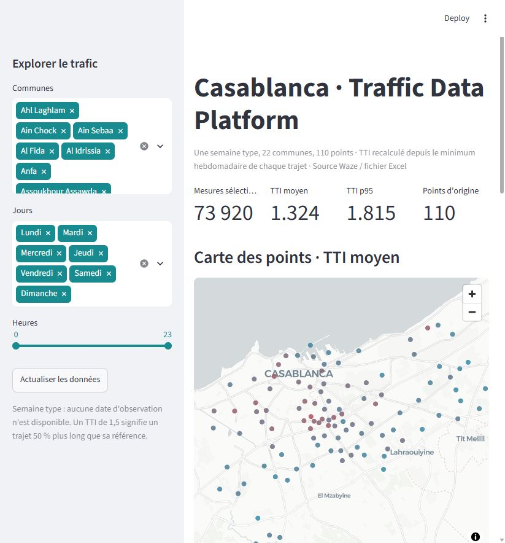
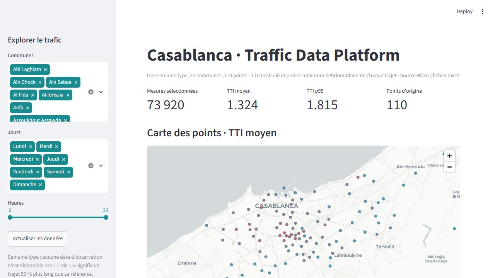
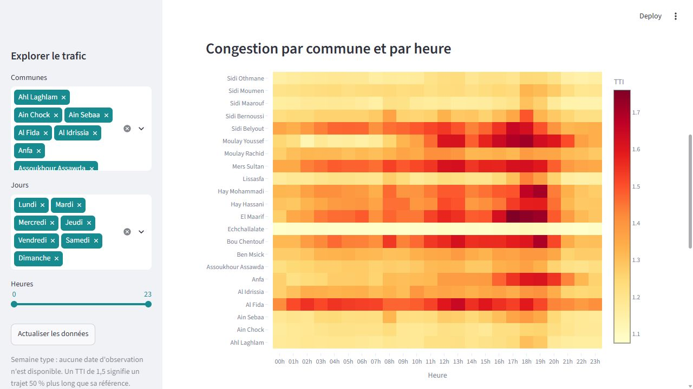
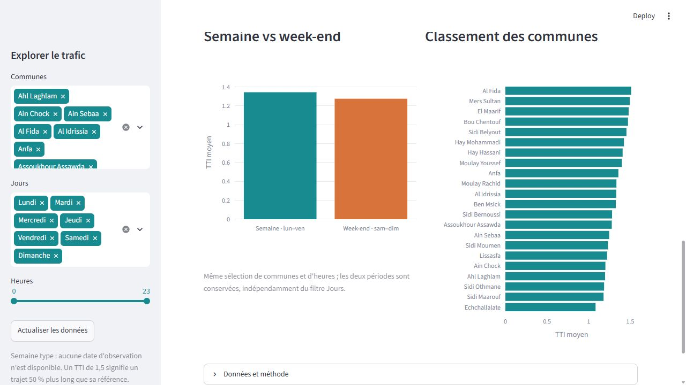
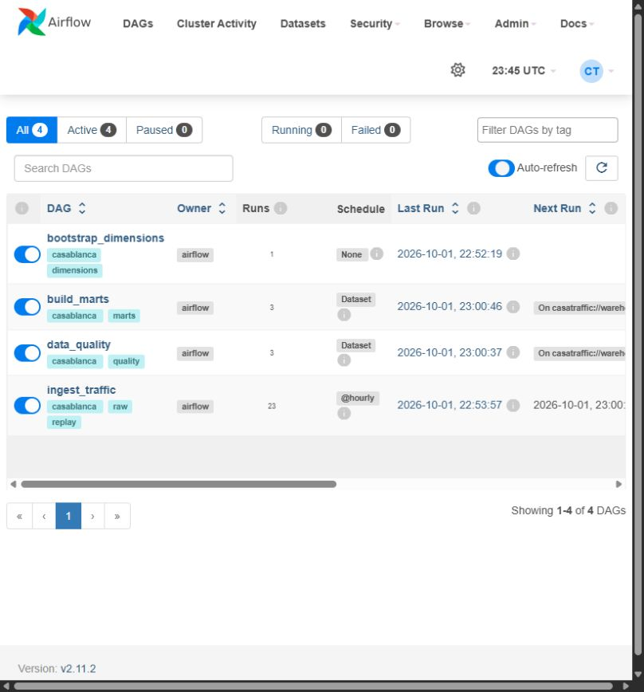
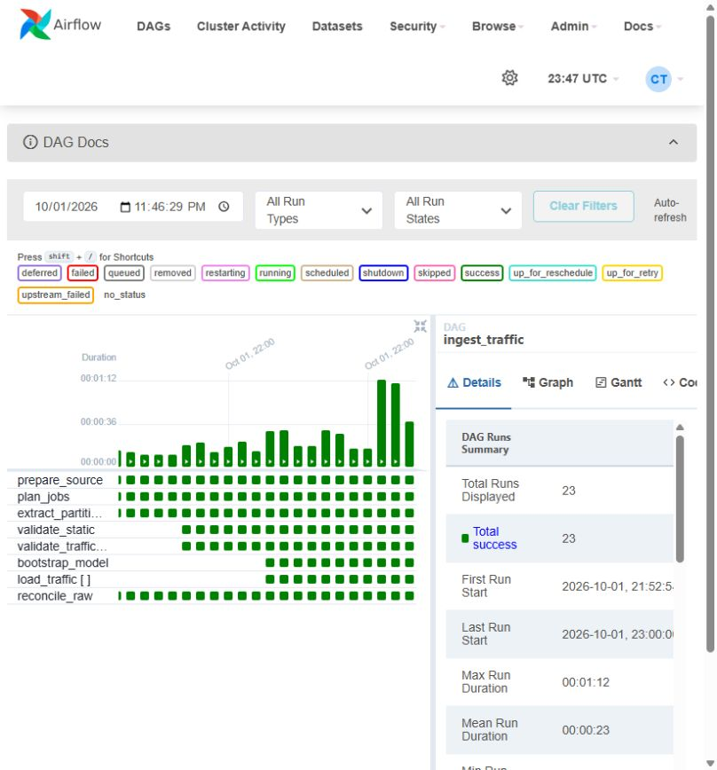

# Casablanca Traffic Data Platform

Plateforme exécutée sur la semaine type du classeur Casablanca : 22 communes,
110 points, 440 trajets et **73 920 observations horaires**. Les phases 0 à 10 du
[plan](docs/project_plan.md) sont documentées avec leurs preuves dans `docs/`.
Python 3.11, RAW Parquet immuable, pandera, PostgreSQL/PostGIS, Airflow TaskFlow
avec dynamic task mapping, marts SQL et dashboard Streamlit dans Docker.
Metabase est également démarré ; sa configuration applicative reste optionnelle.

## Architecture



L'ingestion remplace une partition jour/heure dans une transaction, sous verrou.
Les clés uniques empêchent les doublons ; les dimensions et la référence de temps
libre sont figées pour cette source. Les quatre marts sont reconstruits ensemble,
uniquement après un audit réussi d'un CORE complet. Les erreurs déclenchent un
journal JSON local ; aucun message externe n'est envoyé.

## Installation depuis zéro — Windows PowerShell

Prérequis : Python **3.11**, Git et Docker Desktop avec moteur Linux. Si Python
3.11 est absent, l'installer avant de continuer. Prévoir environ 8 Go de RAM
disponibles pour Docker et Internet pour télécharger les images et dépendances.
Le classeur fourni doit se trouver, sans modification, dans `data/source/`.

```powershell
cd casablanca-traffic-platform
py -3.11 -m venv CasaTraffic
.\CasaTraffic\Scripts\python.exe --version
.\CasaTraffic\Scripts\python.exe -m pip install -r requirements.txt
.\CasaTraffic\Scripts\python.exe -m pip check
.\CasaTraffic\Scripts\python.exe scripts/init_env.py
docker compose config --quiet
docker compose up -d --build
.\CasaTraffic\Scripts\python.exe scripts/bootstrap_platform.py
.\CasaTraffic\Scripts\python.exe scripts/verify_phase9.py
docker compose ps --all
```

`init_env.py` génère des secrets aléatoires et refuse d'écraser un `.env` existant.
Conserver ce fichier lors des redémarrages. `bootstrap_platform.py` attend les
quatre DAGs et l'absence d'erreur d'import. Sur volume neuf, il exécute réellement
les tâches de dimensions et d'ingestion complète avant d'activer les horaires et
Datasets, puis vérifie deux chaînes automatiques ingestion → qualité → marts,
avec comparaison des effectifs et empreintes. La preuve de cette commande sur
un volume vierge est dans [phase10_clean_start.json](docs/phase10_clean_start.json).

Linux/macOS : `python3.11 -m venv CasaTraffic`, puis remplacer l'exécutable local
par `CasaTraffic/bin/python` dans toutes les commandes. Airflow n'est jamais
installé dans CasaTraffic ; `requirements-airflow.txt` appartient à son image.

| Service | Adresse locale | Accès |
|---|---|---|
| Dashboard livré | http://localhost:8501/ | Carte, heatmap, comparaison et classement |
| Airflow | http://localhost:8080/ | Identifiants `AIRFLOW_ADMIN_*` du `.env` |
| Metabase | http://localhost:3000/ | Assistant de configuration non effectué |
| PostgreSQL/PostGIS | 127.0.0.1:5432 | Bases et rôles séparés, secrets `.env` |

Tous les ports sont liés à localhost. Le rôle `traffic_dashboard` n'a que SELECT
sur les quatre tables CORE nécessaires et utilise des transactions en lecture
seule. Le DAG utilise la Connection `casatraffic`, fournie par
`AIRFLOW_CONN_CASATRAFFIC` dans Compose. Les Variables Airflow facultatives sont
`traffic_source_file`, `traffic_raw_root`, `traffic_replay_anchor`,
`traffic_max_error_rate` et `traffic_alert_root` ; les chemins par défaut sont
ceux du conteneur. La configuration est lue pendant les tâches dans
`src/load/airflow_runtime.py`, `dags/dag_ingest_traffic.py` et `src/validate/alerts.py`.

## Exploitation et rejeu

Redémarrer sans effacer les données :

```powershell
docker compose down
docker compose up -d
.\CasaTraffic\Scripts\python.exe scripts/bootstrap_platform.py
```

Le volume PostgreSQL est conservé. Sur un ancien volume créé avant le compte
dashboard, exécuter `scripts/init_dashboard.py` avec le Python CasaTraffic pour
migrer ce rôle sans réinitialiser la base.

Dans Airflow, `ingest_traffic` accepte `{"mode":"full"}` pour les sept jours,
ou `{"mode":"replay","tick":0}` pour lundi à 00 h. Le déclenchement horaire
rejoue la semaine type modulo 168 ; il ne représente pas des observations datées.
Le simulateur peut aussi produire ses 168 partitions immuables localement :

```powershell
.\CasaTraffic\Scripts\python.exe -m src.extract.flow_simulator --source data/source/Dataset_for_traffic_analysis_in_Casablanca__Morocco.xlsx --raw-root data/raw --tick 0 --steps 168
```

Une partition RAW déjà présente est contrôlée par ses empreintes et réutilisée.
Les rejets, réparations et avertissements portent un identifiant stable dans
`public.quarantine`. Le seuil d'erreur s'applique après conservation des rejets.
Les rapports et alertes sont dans `data/quarantine/`; les logs Airflow dans `logs/`.
L'audit global contrôle les 73 920 mesures, les références, les unités et les
formules avant publication du Dataset qualité. Les Datasets coalescent les
événements : les marts reflètent l'état actuel, sans historique de snapshots.

## Modèle et qualité

| Table | Grain | Lignes |
|---|---|---:|
| dim_commune | Commune | 22 |
| dim_point | Point géographique | 110 |
| dim_time | Jour ISO × heure | 168 |
| dim_trajectory | Origine × destination observée | 440 |
| fact_travel_time | Trajet × jour × heure | 73 920 |
| mart_commune_hourly_congestion | Commune × jour × heure | 3 696 |
| mart_peak_hours | Heures de pointe journalières, ex æquo inclus | 154 |
| mart_weekday_vs_weekend | Commune × période | 44 |
| mart_commune_features | Commune | 22 |

Le [dictionnaire](docs/data_dictionary.md) précise clés, unités et champs d'audit.
Le [rapport qualité](docs/data_quality_report.md) contient les observations,
réparations et limites. Résultats sur la source fournie :

| Anomalie | Traitement |
|---|---|
| En-têtes fusionnés, communes/ZIP absents | Lecture des trois niveaux ; propagation limitée aux cellules fusionnées |
| Distances mixtes | 2 764 valeurs quotidiennes converties de mètres en km, soit 66 336 mesures |
| Temps entiers multipliés par 1 000 | 42 174 valeurs corrigées, règle réservée au SHA-256 de ce classeur |
| Indices 110–114 incohérents | Correspondance unique vers 105–109, 280 événements tracés |
| 34 TTI <1 et 171 TTI >5 | Valeurs fournies conservées ; recalcul et journalisation |
| Population/ménages fractionnaires | 14 communes pour chaque champ ; précision conservée |
| Noms irréguliers | Unicode NFKC, espaces et casse normalisés ; aucune correspondance floue |

Le TTI publié vaut `travel_time_min / min(travel_time_min)` du trajet sur les
168 créneaux corrigés. Cette référence empirique n'est pas une vitesse libre
mesurée indépendamment. Le TTI moyen vaut 1,323890 et son p95 1,815377.
70 810 observations ont un écart absolu >0,1 avec le TTI fourni. La suite annoncée
des maxima 5, 6, …, 23 n'est pas observée dans le fichier analysé.
Le journal contient 485 événements (314 réparables, 171 avertissements), **aucun
rejet définitif** sur cette source. Les lignes réparées restent dans les faits.

## Vérification et CI

```powershell
.\CasaTraffic\Scripts\python.exe -m ruff check .
.\CasaTraffic\Scripts\python.exe -m pytest -q
.\CasaTraffic\Scripts\python.exe scripts/run_integration_tests.py
$env:PATH = "$PWD\CasaTraffic\Scripts;$env:PATH"
.\CasaTraffic\Scripts\python.exe -m pre_commit install
.\CasaTraffic\Scripts\python.exe -m pre_commit run --all-files
```

Les tests PostgreSQL utilisent une base temporaire identifiée, pas la base de
trafic courante. Ils prouvent la stabilité d'un second chargement, la conservation
d'un rejet et le rollback atomique en cas d'échec SQL. Les trois tests de DAG
sont exécutés dans l'image Airflow, où Airflow est installé ; leur saut local est
attendu. Les quatre tests dashboard exécutent aussi l'application avec AppTest.
`.github/workflows/ci.yml` vérifie lint, tests et construction des deux images.
La CI est configurée ; aucun run GitHub n'est revendiqué, aucun remote n'étant
configuré dans ce dépôt.

Pour refaire le contrôle complet sur un volume neuf isolé :

```powershell
.\CasaTraffic\Scripts\python.exe scripts/verify_clean_start.py
```

Ce contrôle réutilise les images construites, crée des ports/secrets/volume
distincts et retire exclusivement ses ressources Docker temporaires à la fin.
Les preuves de chaque phase, dont l'idempotence des quatre DAGs, sont dans `docs/`.

## Dashboard et captures

La refonte UX commence par l'[audit de l'existant](docs/dashboard_audit.md),
avec capture avant refonte et contrôle de la sélection vide. Le dashboard
fonctionnel ci-dessous correspond encore à la version initiale.
La [maquette textuelle](docs/dashboard_wireframe.md) définit les six onglets,
les KPI, filtres partageables, thèmes et règles de qualité de la refonte.
L'[implémentation modulaire](docs/dashboard_implementation.md) est dans `dashboard/`.
Le [déploiement Docker vérifié](docs/dashboard_deployment.md) utilise maintenant
cette version sur le port 8501, avec compte SQL en lecture seule et collecteur
de métadonnées séparé. Les contrôles et mesures SQL sont dans
`docs/dashboard_deployment.json` ; la validation UX exhaustive reste à compléter.






La carte affiche le TTI moyen par point ; le fond CARTO demande Internet et WebGL.
La heatmap compare les communes par heure. La comparaison semaine/week-end utilise
les mêmes communes/heures, indépendamment du filtre jours, comme indiqué dans
l'interface. Le classement et les p95 sont calculés directement sur les faits
filtrés, sans moyenner des percentiles ; les agrégats hebdomadaires sont vérifiés
contre les marts. Cache de 60 secondes, actualisation manuelle et export CSV.







## Structure et limites

L'[arborescence complète](docs/repository_tree.txt) détaille les fichiers livrés.
`dags/`, `src/{extract,transform,validate,load}`, `sql/{ddl,marts}`, `tests/`,
`notebooks/`, `data/{source,raw,quarantine}` et `docs/` suivent le plan.
CasaTraffic, `.env`, RAW généré, logs et ressources temporaires sont ignorés par Git.

La source couvre une semaine type, sans dates d'observation ni trafic en direct.
Les corrections dépendant du classeur doivent être réévaluées pour une nouvelle
source. Les variations de distance restent conservées dans les faits ; la
dimension trajet utilise la référence du lundi. L'unité de densité source est
inconnue ; la densité calculée par km² est un champ distinct.

Extensions possibles : données datées supplémentaires, historique des snapshots,
alertes externes configurées, tableau Metabase, déploiement avec TLS et sauvegardes,
modèles de congestion après validation statistique. Spark, Kafka et dbt ne sont
pas nécessaires au volume actuel et ne sont pas implémentés.
